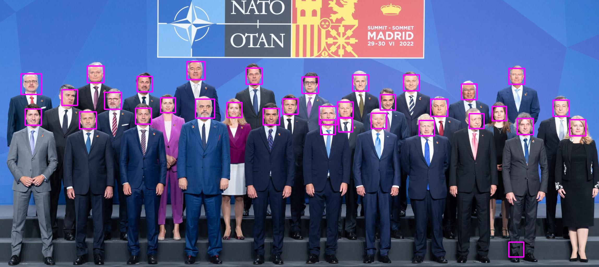
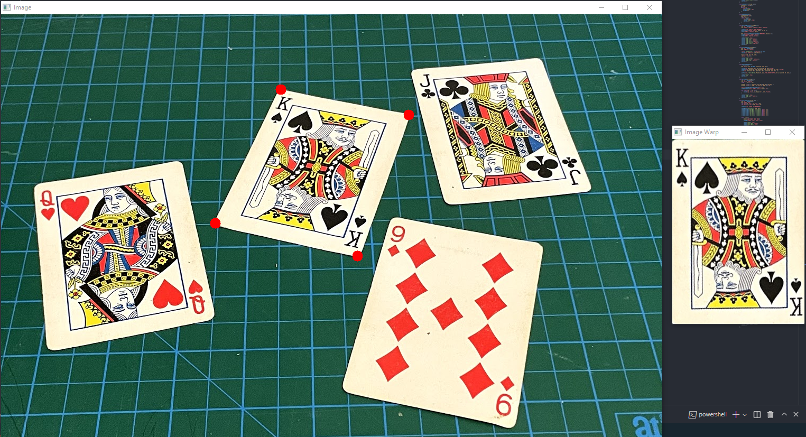
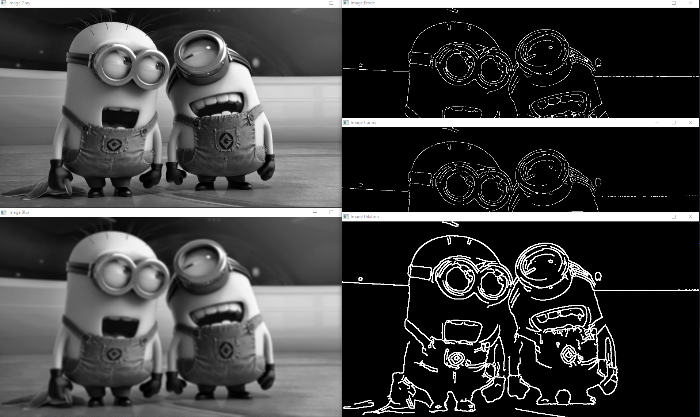
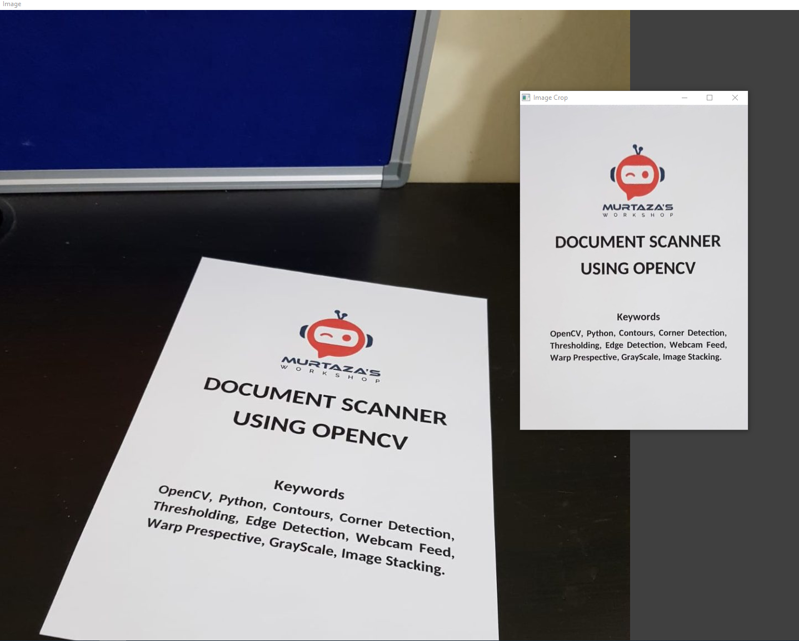
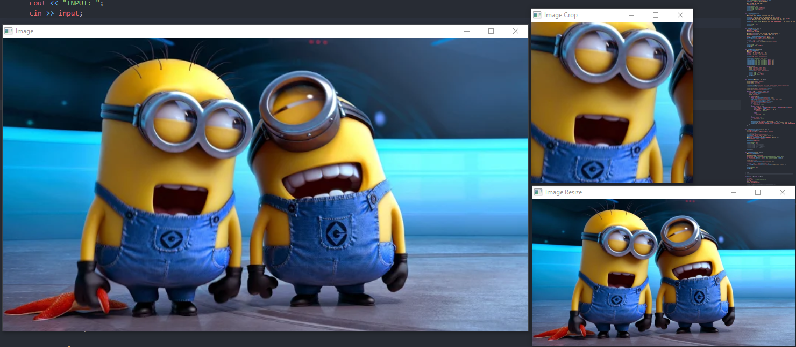
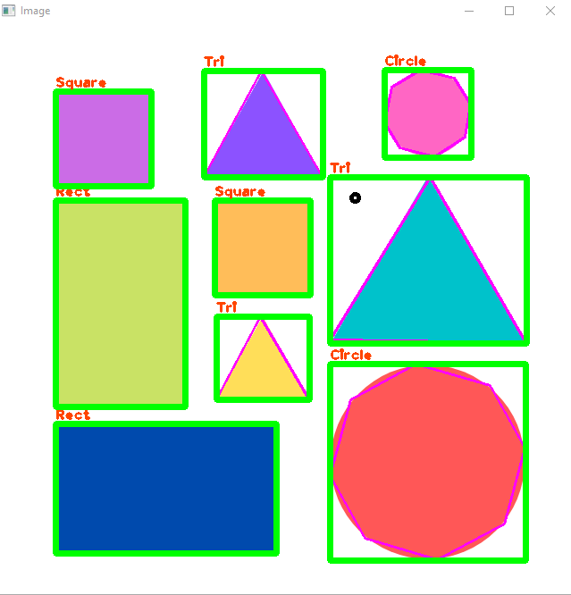

* DEVELOPMENT STILL CONTINUES
* Linux and Windows used during development

# Aplication Screenshots

# A. Linux Requirements

# 1. Install OpenCV

* Install minimal prerequisites

        sudo apt update && sudo apt install -y cmake g++ wget unzip

* Download and unpack sources

        wget -O opencv.zip https://github.com/opencv/opencv/archive/4.x.zip
        wget -O opencv_contrib.zip https://github.com/opencv/opencv_contrib/archive/4.x.zip
        unzip opencv.zip
        unzip opencv_contrib.zip

* Create build directory and switch into it
        
        mkdir -p build && cd build

* Configure
        
        cmake -DOPENCV_EXTRA_MODULES_PATH=../opencv_contrib-4.x/modules ../opencv-4.x

* Build
        
        cmake --build .

* MAKE Build Files
        
        make -j4

* Save To OS
        
        sudo make install

* Copy Libraries

        cp -r /usr/local/include/opencv4/opencv2 /usr/include/c++/10

# 2. Install OpenCV Dependencies

* ## 2.1. Easiest Way Install The Dependencies To Linux
      
      sudo apt-get install libopencv-*

* ## 2.2. Manuel Installation
    
      sudo apt-get install python-dev python3-dev libqt4-dev libgphoto2-dev python3-numpy python-numpy libv4l-dev libv4l2rds0 libgtk-3-dev libgstreamer-plugins-base1.0-dev libgst-dev cmake-qt-gui build-essential cmake git libgtk2.0-dev pkg-config libavcodec-dev libswscale-dev libtbb2 libtbb-dev libjpeg-dev libpng-dev libtiff-dev libjasper-dev libdc1394-22-dev libgstreamer-vaapi1.0-dev libavformat-dev libavformat-ffmpeg-dev -y

# 3. Build And Run

## 3.1. Build :

    mkdir build && cd build
    cmake ..
    cmake --build .

## 3.2. Run

    ./ImageProcessing <IMAGE_PATH>/<image_name>

# B. Windows Requirements

* CMake https://cmake.org/download/
* MinGW https://github.com/niXman/mingw-builds-binaries/releases (choose posix version. thread choosing should be posix)
* OpenCV (Normal) https://opencv.org/releases/
* OpenCV (Built By MinGW) https://github.com/huihut/OpenCV-MinGW-Build

## 1. Setup OpenCV

* Download and extract official OpenCV 
* Download opencv_mingw_build
* Go To -> opencv_mingw_build/x64 (you should see mingw file)
* Copy mingw file to official OpenCV directory -> official_opencv/build/x64
* Last of all opencv/build/include/opencv2 file can be copy to mingw include dir

## 2. Set Path

Add these values to PATH

        C:\<path>\CMake\bin
        C:\<path>\mingw64\bin
        C:\<path>\official_opencv\build\x64\mingw\bin

# 3. Build And Run

## 3.1. Build :

       mkdir build && cd build
       cmake .. -G "MinGW Makefiles"
       cmake --build .

## 3.2. Run
 
    ./ImageProcessing <IMAGE_PATH>

## IDE Configurations

### VS Code

If you use windows, this config can be helpful

If libraries has warning underline, IDE can't see library than you can change include and compiler directory. 

* Mouse should be on the warning underline and select quick fix automaticly  c_cpp_properties.json file create and then change like this example:

* Add These Lines 

        {
            "configurations": [
                {
                    "name": "Win32",
                    "includePath": [
                        "${workspaceFolder}/**",
                        "C:\\mingw64\\x86_64-w64-mingw32\\include"
                    ],
                    "defines": [
                        "_DEBUG",
                        "UNICODE",
                        "_UNICODE"
                    ],
                    "windowsSdkVersion": "10.0.22000.0",
                    "compilerPath": "C:\\mingw64\\bin\\gcc.exe",
                    "cStandard": "gnu17",
                    "cppStandard": "gnu++17",
                    "intelliSenseMode": "windows-gcc-x64"
                }
            ],
            "version": 4
        }        

* You can maually create config file under this line: 

        <workspace_dir>/.vscode/c_cpp_properties.json

## Sources

* Murtaza Workshops 

        www.computervision.zone
        www.youtube.com/@murtazasworkshop
        https://www.youtube.com/watch?v=2FYm3GOonhk

Resource's and codes taken from Murtaza.